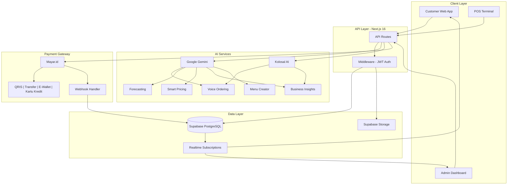
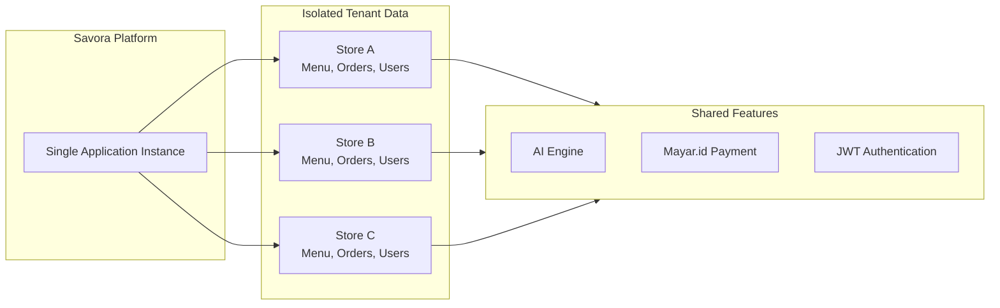
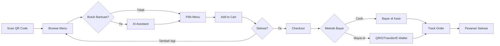
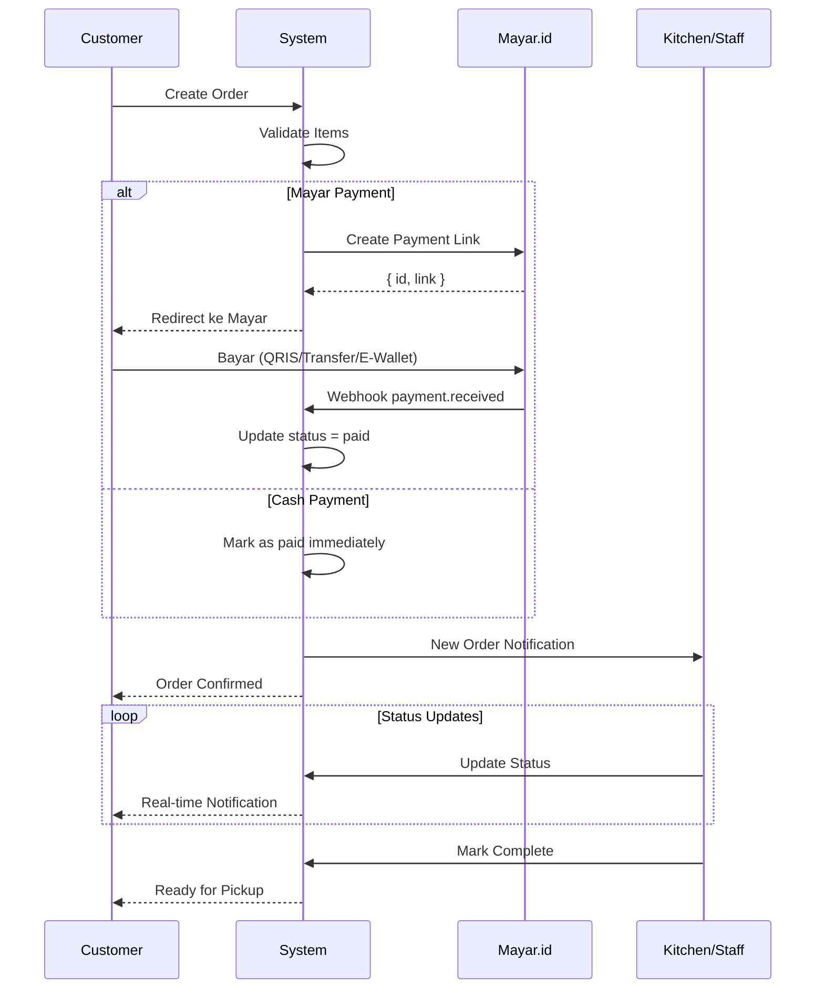
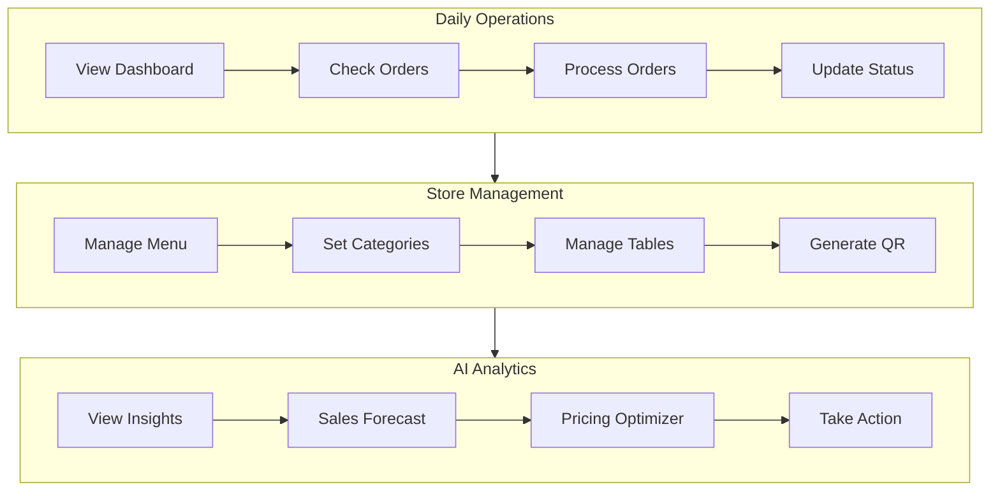
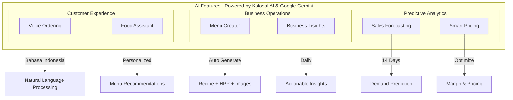
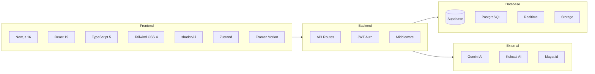
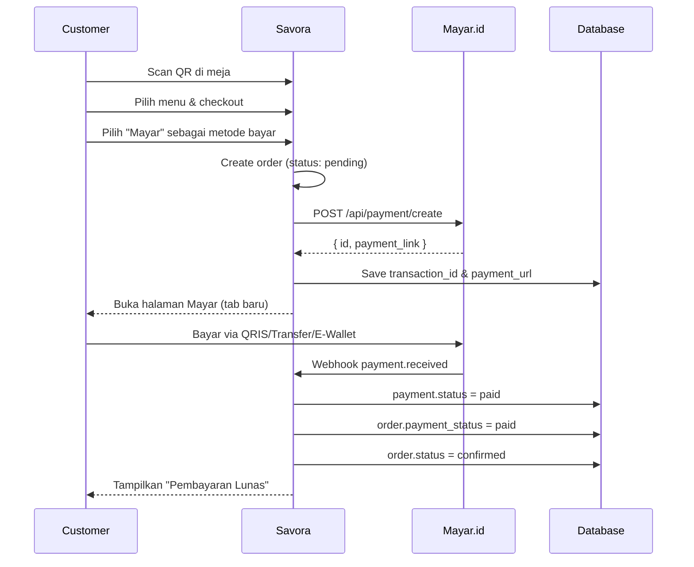
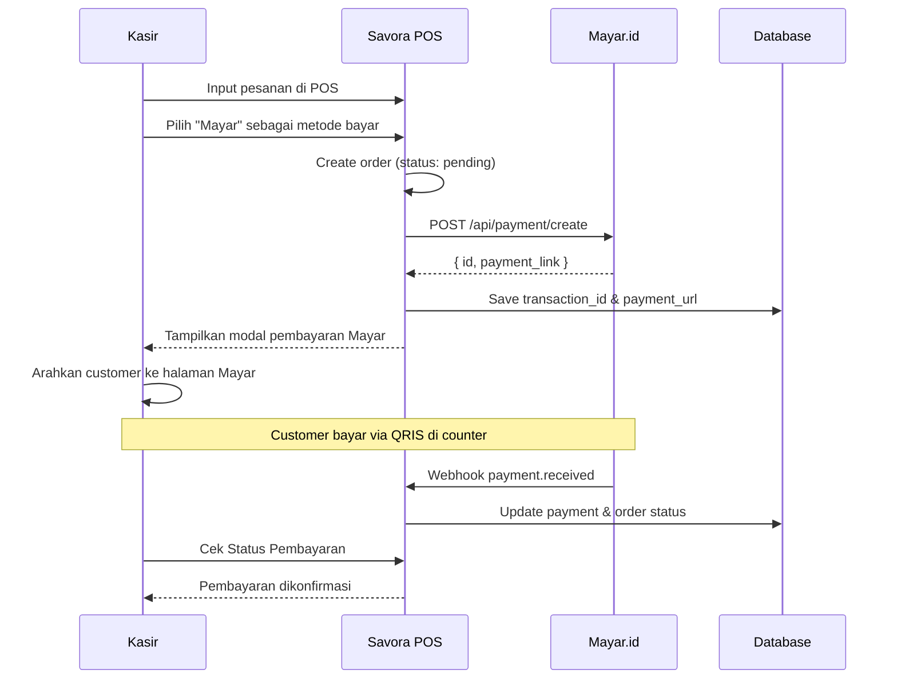

<p align="center">
  
</p>

<h1 align="center">Savora</h1>

<p align="center">
  <strong>Platform Manajemen Restoran Berbasis AI Pertama di Indonesia untuk UMKM F&B</strong>
</p>

<p align="center">
  <em>Powered by <a href="https://kolosal.ai">Kolosal.ai</a> &middot; Payment by <a href="https://mayar.id">Mayar.id</a></em>
</p>

<p align="center">
  
  
  
  
  
  
  
</p>

<p align="center">
  <a href="https://savorai.vercel.app">Live Demo</a> &middot;
  <a href="https://youtu.be/SjMy8e7XLrs">Video Demo</a> &middot;
  <a href="#-integrasi-mayarid---deep-dive">Mayar.id Integration</a> &middot;
  <a href="https://kolosal.ai">Kolosal.ai</a>
</p>

<p align="center">
  <a href="#masalah-yang-diselesaikan">Masalah</a> &middot;
  <a href="#solusi-savora">Solusi</a> &middot;
  <a href="#arsitektur">Arsitektur</a> &middot;
  <a href="#fitur-utama">Fitur</a> &middot;
  <a href="#tech-stack">Tech Stack</a> &middot;
  <a href="#-integrasi-mayarid---deep-dive">Mayar.id</a> &middot;
  <a href="#instalasi">Instalasi</a>
</p>

---

## Tentang Proyek Ini

**Savora** adalah platform manajemen restoran all-in-one yang dibangun sepenuhnya menggunakan pendekatan **vibecoding** dengan bantuan **Agentic AI**. Proyek ini mendemonstrasikan bagaimana AI dapat mempercepat proses development dari ide hingga produk siap pakai, termasuk integrasi payment gateway **[Mayar.id](https://mayar.id)** untuk menerima pembayaran digital secara end-to-end.

> **Vibecoding Approach**: Seluruh fitur mulai dari arsitektur multi-tenant, 6 fitur AI, sistem POS, hingga integrasi pembayaran Mayar.id dikembangkan menggunakan AI-assisted development, membuktikan bahwa vibecoding mampu menghasilkan aplikasi production-grade yang kompleks.

---

## Link Penting

| | Link |
|---|---|
| **Website** | [https://savorai.vercel.app](https://savorai.vercel.app) |
| **Demo Video** | [https://youtu.be/SjMy8e7XLrs](https://youtu.be/SjMy8e7XLrs) |
| **Powered by** | [Kolosal.ai](https://kolosal.ai) - LLM Indonesia |
| **Payment** | [Mayar.id](https://mayar.id) - Payment Gateway Indonesia |

---

## Demo Video

<p align="center">
  <a href="https://youtu.be/SjMy8e7XLrs">
    
  </a>
</p>

<p align="center">
  <em>Klik gambar di atas untuk menonton demo video di YouTube</em>
</p>

---

## Screenshots

<details>
<summary><strong>Landing Page & Authentication</strong></summary>
<br/>

| Landing Page | Login |
|:---:|:---:|
|  |  |

</details>

<details>
<summary><strong>Admin Dashboard</strong></summary>
<br/>

| Dashboard | Analytics |
|:---:|:---:|
|  |  |

| Pesanan | Menu |
|:---:|:---:|
|  |  |

| Meja & QR Code | Users |
|:---:|:---:|
|  |  |

| POS Kasir | Pengaturan |
|:---:|:---:|
|  |  |

</details>

<details>
<summary><strong>Customer Experience</strong></summary>
<br/>

| Order Menu | AI Chatbot |
|:---:|:---:|
|  |  |

| Voice AI Ordering | Payment |
|:---:|:---:|
|  |  |

| Order Tracking |
|:---:|
|  |

</details>

---

## Masalah yang Diselesaikan

UMKM F&B di Indonesia menghadapi berbagai tantangan operasional yang menghambat pertumbuhan bisnis:

| Masalah | Dampak |
|---------|--------|
| **Pencatatan Manual** | Order tertukar, salah input, data tidak akurat |
| **Antrian Panjang** | Pelanggan menunggu lama, experience buruk |
| **Tidak Ada Data Insight** | Keputusan bisnis berdasarkan feeling, bukan data |
| **Forecasting Sulit** | Stok berlebih atau kehabisan, food waste tinggi |
| **Pricing Tidak Optimal** | Margin tipis karena harga tidak sesuai demand |
| **Pembayaran Terbatas** | Hanya terima cash, kehilangan pelanggan yang ingin bayar digital |
| **Biaya Software Mahal** | Solusi enterprise terlalu mahal untuk UMKM |

> Menurut data BPS, lebih dari 60% UMKM F&B masih menggunakan pencatatan manual dan kesulitan mengadopsi teknologi karena keterbatasan biaya dan kompleksitas sistem.

---

## Solusi Savora

Savora adalah platform manajemen restoran all-in-one yang dirancang khusus untuk UMKM F&B di Indonesia. Dengan fitur AI terintegrasi menggunakan **Google Gemini** dan **Kolosal AI** (LLM Indonesia), serta pembayaran digital via **[Mayar.id](https://mayar.id)**, Savora membantu pemilik bisnis kuliner untuk mengelola operasional, menerima pembayaran multi-channel, dan memberikan pengalaman terbaik kepada pelanggan.

### Keunggulan

| | |
|---|---|
| **AI-Powered** | 6 fitur AI canggih: voice ordering, chatbot, menu creator, business insights, forecasting, smart pricing |
| **Multi-tenant** | Satu platform untuk banyak toko dengan data terisolasi per tenant |
| **QR Ordering** | Pelanggan pesan langsung dari meja via scan QR code - zero contact |
| **Pembayaran Digital** | Integrasi [Mayar.id](https://mayar.id) untuk QRIS, transfer bank, e-wallet, dan kartu kredit |
| **Real-time** | Update pesanan dan notifikasi secara real-time via Supabase Realtime |
| **POS System** | Sistem kasir lengkap dengan dukungan pembayaran Mayar.id |
| **Mobile-first** | Desain responsif untuk penggunaan di berbagai device |

---

## Arsitektur

### System Architecture


```mermaid
flowchart TB
    subgraph Client["Client Layer"]
        CW[Customer Web App]
        AW[Admin Dashboard]
        POS[POS Terminal]
    end

    subgraph API["API Layer - Next.js 16"]
        NEXT[API Routes]
        MW[Middleware - JWT Auth]
    end

    subgraph AI["AI Services"]
        GEM[Google Gemini]
        KOL[Kolosal AI]
        VO[Voice Ordering]
        FC[Forecasting]
        PR[Smart Pricing]
        IN[Business Insights]
        MC[Menu Creator]
    end

    subgraph Data["Data Layer"]
        SB[(Supabase PostgreSQL)]
        ST[Supabase Storage]
        RT[Realtime Subscriptions]
    end

    subgraph Payment["Payment Gateway"]
        MY[Mayar.id]
        WH[Webhook Handler]
        PM["QRIS | Transfer | E-Wallet | Kartu Kredit"]
    end

    CW --> NEXT
    AW --> NEXT
    POS --> NEXT
    NEXT --> MW
    MW --> SB
    MW --> ST
    NEXT --> GEM
    NEXT --> KOL
    GEM --> VO
    GEM --> FC
    GEM --> PR
    GEM --> IN
    GEM --> MC
    KOL --> VO
    KOL --> IN
    NEXT --> MY
    MY --> PM
    MY --> WH
    WH --> SB
    SB --> RT
    RT --> CW
    RT --> AW
```

### Multi-Tenant Architecture


```mermaid
flowchart LR
    subgraph Platform["Savora Platform"]
        APP[Single Application Instance]
    end

    subgraph Tenants["Isolated Tenant Data"]
        S1[Store A<br/>Menu, Orders, Users]
        S2[Store B<br/>Menu, Orders, Users]
        S3[Store C<br/>Menu, Orders, Users]
    end

    subgraph Features["Shared Features"]
        AI[AI Engine]
        PAY[Mayar.id Payment]
        AUTH[JWT Authentication]
    end

    APP --> S1
    APP --> S2
    APP --> S3
    S1 --> Features
    S2 --> Features
    S3 --> Features
```

---

## Application Flow

### Customer Journey


```mermaid
flowchart LR
    A[Scan QR Code] --> B[Browse Menu]
    B --> C{Butuh Bantuan?}
    C -->|Ya| D[AI Assistant]
    C -->|Tidak| E[Pilih Menu]
    D --> E
    E --> F[Add to Cart]
    F --> G{Selesai?}
    G -->|Tambah lagi| B
    G -->|Ya| H[Checkout]
    H --> I{Metode Bayar}
    I -->|Cash| J1[Bayar di Kasir]
    I -->|Mayar.id| J2[QRIS/Transfer/E-Wallet]
    J1 --> K[Track Order]
    J2 --> K
    K --> L[Pesanan Selesai]
```

### Order Processing Flow


```mermaid
sequenceDiagram
    participant C as Customer
    participant S as System
    participant M as Mayar.id
    participant K as Kitchen/Staff

    C->>S: Create Order
    S->>S: Validate Items

    alt Mayar Payment
        S->>M: Create Payment Link
        M-->>S: { id, link }
        S-->>C: Redirect ke Mayar
        C->>M: Bayar (QRIS/Transfer/E-Wallet)
        M->>S: Webhook payment.received
        S->>S: Update status = paid
    else Cash Payment
        S->>S: Mark as paid immediately
    end

    S->>K: New Order Notification
    S-->>C: Order Confirmed

    loop Status Updates
        K->>S: Update Status
        S-->>C: Real-time Notification
    end

    K->>S: Mark Complete
    S-->>C: Ready for Pickup
```

### Admin Workflow


```mermaid
flowchart TB
    subgraph Daily["Daily Operations"]
        D1[View Dashboard] --> D2[Check Orders]
        D2 --> D3[Process Orders]
        D3 --> D4[Update Status]
    end

    subgraph Management["Store Management"]
        M1[Manage Menu] --> M2[Set Categories]
        M2 --> M3[Manage Tables]
        M3 --> M4[Generate QR]
    end

    subgraph Analytics["AI Analytics"]
        A1[View Insights] --> A2[Sales Forecast]
        A2 --> A3[Pricing Optimizer]
        A3 --> A4[Take Action]
    end

    Daily --> Management
    Management --> Analytics
```

---

## Fitur Utama

### AI Features (6 Fitur AI)

Powered by **Google Gemini** dan **Kolosal AI**, fitur AI terintegrasi untuk meningkatkan operasional dan penjualan:


```mermaid
flowchart TB
    subgraph AI["AI Features - Powered by Kolosal AI & Google Gemini"]
        direction TB

        subgraph Customer["Customer Experience"]
            VO[Voice Ordering]
            FA[Food Assistant]
        end

        subgraph Operations["Business Operations"]
            MC[Menu Creator]
            BI[Business Insights]
        end

        subgraph Analytics["Predictive Analytics"]
            FC[Sales Forecasting]
            SP[Smart Pricing]
        end
    end

    VO --> |Bahasa Indonesia| O1[Natural Language Processing]
    FA --> |Personalized| O2[Menu Recommendations]
    MC --> |Auto Generate| O3[Recipe + HPP + Images]
    BI --> |Daily| O4[Actionable Insights]
    FC --> |14 Days| O5[Demand Prediction]
    SP --> |Optimize| O6[Margin & Pricing]
```

| # | Fitur | Deskripsi | AI Engine | Manfaat |
|---|-------|-----------|-----------|---------|
| 1 | **Voice Ordering** | Pesan dengan berbicara dalam Bahasa Indonesia | Gemini + Kolosal | Pemesanan cepat, accessible untuk semua usia |
| 2 | **AI Food Assistant** | Chatbot rekomendasi menu berdasarkan preferensi | Kolosal AI | Upselling otomatis, personalized experience |
| 3 | **AI Menu Creator** | Generate resep lengkap, kalkulasi HPP, dan gambar menu | Gemini (Vision) | Efisiensi R&D menu, dari ide ke menu dalam hitungan detik |
| 4 | **Business Insights** | Analisis bisnis harian dengan tips actionable | Gemini | Keputusan berbasis data, bukan feeling |
| 5 | **Sales Forecasting** | Prediksi penjualan 14 hari ke depan | Gemini | Perencanaan stok akurat, kurangi food waste |
| 6 | **Smart Pricing** | Rekomendasi harga optimal berdasarkan data | Gemini | Margin lebih baik, pricing competitive |

### Customer Features

| Fitur | Deskripsi |
|-------|-----------|
| QR Code Ordering | Scan QR di meja untuk mulai pesan - zero contact ordering |
| Menu Browsing | Jelajahi menu dengan filter kategori dan pencarian |
| AI Voice Ordering | Pesan hanya dengan berbicara dalam Bahasa Indonesia |
| AI Recommendations | Rekomendasi menu personal dari AI chatbot |
| Shopping Cart | Keranjang belanja dengan update real-time |
| Multi-Payment | Tunai & **Mayar.id** (QRIS, transfer bank, e-wallet, kartu kredit) |
| Order Tracking | Lacak status pesanan secara real-time |

### Admin Features

| Fitur | Deskripsi |
|-------|-----------|
| Dashboard Analytics | Statistik penjualan real-time: revenue, total order, rata-rata order, grafik tren |
| Menu Management | Kelola menu dengan gambar, harga, kategori, dan ketersediaan |
| AI Menu Creator | Buat menu baru dengan bantuan AI - dari resep hingga gambar |
| Table & QR Management | Generate dan kelola QR code per meja, tracking status meja |
| Order Management | Kelola pesanan dengan status real-time dan update otomatis |
| POS System | Point of Sale untuk kasir dengan integrasi **Mayar.id** untuk pembayaran digital |
| Business Analytics | AI-powered: forecasting, smart pricing, dan business insights |
| User Management | Kelola staff dengan role-based access control (owner, staff) |
| Multi-outlet | Kelola banyak outlet dalam satu dashboard (multi-tenant) |
| Store Settings | Konfigurasi toko: pajak, service charge, jam operasional |
| FTUE & Guided Tour | Onboarding experience untuk pengguna baru |

---

## Tech Stack


```mermaid
flowchart LR
    subgraph Frontend
        NEXT[Next.js 16]
        REACT[React 19]
        TS[TypeScript 5]
        TW[Tailwind CSS 4]
        SHAD[shadcn/ui]
        ZUS[Zustand]
        FM[Framer Motion]
    end

    subgraph Backend
        API[API Routes]
        JWT[JWT Auth]
        MW[Middleware]
    end

    subgraph Database
        SB[(Supabase)]
        PG[PostgreSQL]
        RT[Realtime]
        ST[Storage]
    end

    subgraph External
        GEM[Gemini AI]
        KOL[Kolosal AI]
        MY[Mayar.id]
    end

    Frontend --> Backend
    Backend --> Database
    Backend --> External
```

| Kategori | Teknologi | Alasan |
|----------|-----------|--------|
| **Framework** | Next.js 16 (App Router) | Server Components, API routes, streaming, optimized builds |
| **UI Library** | React 19 | Concurrent features, Server Components support |
| **Language** | TypeScript 5 | Type safety, better developer experience, catch bugs early |
| **Database** | Supabase (PostgreSQL) | Managed database, realtime subscriptions, Row Level Security |
| **AI/ML** | Google Gemini | Multimodal LLM - text, vision, voice capabilities |
| **AI/ML** | [Kolosal AI](https://kolosal.ai) | LLM Indonesia - optimized untuk bahasa dan konteks Indonesia |
| **Styling** | Tailwind CSS 4 + shadcn/ui | Rapid development, consistent design system |
| **State** | Zustand | Lightweight, performant client-side state management |
| **Animation** | Framer Motion | Smooth page transitions dan micro-interactions |
| **Forms** | React Hook Form + Zod | Type-safe form validation |
| **Auth** | JWT + bcrypt | Stateless authentication, secure password hashing |
| **Payment** | [Mayar.id](https://mayar.id) | Payment gateway Indonesia - QRIS, transfer bank, e-wallet, kartu kredit |

---

## Integrasi Mayar.id - Deep Dive

Savora terintegrasi penuh dengan **[Mayar.id](https://mayar.id)** sebagai payment gateway utama. Integrasi Mayar tersedia di **2 touchpoint** berbeda dalam aplikasi:

### Titik Integrasi Mayar

| # | Lokasi | Pengguna | Deskripsi |
|---|--------|----------|-----------|
| 1 | **Customer Checkout** | Pelanggan | Pembayaran saat checkout setelah scan QR dan pesan menu |
| 2 | **POS Kasir** | Kasir/Admin | Pembayaran digital saat kasir membuat pesanan untuk walk-in customer |

### Fitur Integrasi

| Fitur | Detail |
|-------|--------|
| **Payment Link Generation** | Otomatis buat link pembayaran Mayar saat checkout/POS |
| **Multi-method Payment** | QRIS, transfer bank (BCA, BNI, Mandiri), e-wallet (GoPay, OVO, DANA, ShopeePay), kartu kredit |
| **Webhook Real-time** | Status pembayaran update otomatis via webhook `payment.received` |
| **Sandbox & Production** | Support environment sandbox untuk testing, production untuk live |
| **Payment Status Tracking** | Cek status pembayaran real-time dari halaman konfirmasi dan POS |
| **24-Hour Expiry** | Payment link otomatis expire setelah 24 jam |

### Flow 1: Customer Checkout (QR Order)


```mermaid
sequenceDiagram
    participant C as Customer
    participant S as Savora
    participant M as Mayar.id
    participant DB as Database

    C->>S: Scan QR di meja
    C->>S: Pilih menu & checkout
    C->>S: Pilih "Mayar" sebagai metode bayar
    S->>S: Create order (status: pending)
    S->>M: POST /api/payment/create
    M-->>S: { id, payment_link }
    S->>DB: Save transaction_id & payment_url
    S-->>C: Buka halaman Mayar (tab baru)
    C->>M: Bayar via QRIS/Transfer/E-Wallet
    M->>S: Webhook payment.received
    S->>DB: payment.status = paid
    S->>DB: order.payment_status = paid
    S->>DB: order.status = confirmed
    S-->>C: Tampilkan "Pembayaran Lunas"
```

### Flow 2: POS Kasir (Walk-in Customer)


```mermaid
sequenceDiagram
    participant K as Kasir
    participant S as Savora POS
    participant M as Mayar.id
    participant DB as Database

    K->>S: Input pesanan di POS
    K->>S: Pilih "Mayar" sebagai metode bayar
    S->>S: Create order (status: pending)
    S->>M: POST /api/payment/create
    M-->>S: { id, payment_link }
    S->>DB: Save transaction_id & payment_url
    S-->>K: Tampilkan modal pembayaran Mayar
    K->>K: Arahkan customer ke halaman Mayar
    Note over K,M: Customer bayar via QRIS di counter
    M->>S: Webhook payment.received
    S->>DB: Update payment & order status
    K->>S: Cek Status Pembayaran
    S-->>K: Pembayaran dikonfirmasi
```

### Arsitektur Payment

```
src/
├── lib/mayar/
│   └── client.ts                    # Mayar API client (createSinglePayment)
├── app/api/payment/
│   ├── create/route.ts              # POST - Buat payment link Mayar
│   └── webhook/mayar/route.ts       # POST - Webhook receiver
├── app/api/admin/orders/
│   └── [orderId]/payment/route.ts   # GET/POST - Cek & update status pembayaran
├── components/customer/
│   └── mayar-payment-status.tsx     # UI komponen status pembayaran
├── app/[storeSlug]/order/
│   ├── checkout/page.tsx            # Customer checkout + Mayar
│   └── confirmation/[orderId]/      # Halaman konfirmasi pembayaran
└── app/admin/pos/
    └── POSClient.tsx                # POS kasir + Mayar integration
```

### Database Schema (Payment)

```sql
-- Orders table
CREATE TABLE orders (
    id UUID PRIMARY KEY DEFAULT gen_random_uuid(),
    store_id UUID REFERENCES stores(id),
    order_number VARCHAR(50) UNIQUE,
    status order_status DEFAULT 'pending',
    payment_status payment_status DEFAULT 'unpaid',
    total DECIMAL(12,2),
    -- ... other fields
);

-- Payments table
CREATE TABLE payments (
    id UUID PRIMARY KEY DEFAULT gen_random_uuid(),
    order_id UUID REFERENCES orders(id),
    payment_method payment_method_enum,    -- 'mayar', 'cash', 'qris', etc.
    payment_gateway VARCHAR(50),           -- 'mayar', 'manual'
    transaction_id VARCHAR(255),           -- Mayar payment ID
    payment_url TEXT,                      -- Mayar payment link
    status payment_status DEFAULT 'pending',
    amount DECIMAL(12,2),
    paid_at TIMESTAMPTZ,
    raw_response JSONB,                    -- Full webhook data
    -- ... timestamps
);
```

### Setup Mayar.id

1. **Daftar akun** di [web.mayar.club](https://web.mayar.club) (sandbox) atau [web.mayar.id](https://web.mayar.id) (production)
2. **Generate API key** dari dashboard Mayar
3. **Set environment variables:**
```env
MAYAR_API_KEY=your_mayar_api_key
MAYAR_IS_PRODUCTION=false    # true untuk production
```
4. **Set webhook URL** di Mayar dashboard:
```
https://your-domain.com/api/payment/webhook/mayar
```
5. **Test di sandbox** - gunakan test credentials dari Mayar untuk simulasi pembayaran

---

## Instalasi

### Prerequisites

- Node.js 18.0+
- npm / yarn / pnpm
- Supabase account ([supabase.com](https://supabase.com))
- Mayar.id account ([mayar.id](https://mayar.id)) - untuk fitur payment
- Google Cloud account (optional, untuk AI Gemini)
- Kolosal AI API key ([kolosal.ai](https://kolosal.ai)) - untuk AI Indonesia

### Quick Start

```bash
# Clone repository
git clone https://github.com/mocharil/savora.git
cd savora

# Install dependencies
npm install

# Setup environment
cp .env.example .env
# Edit .env with your credentials (lihat section Environment Variables)

# Run database migrations
# Jalankan file-file SQL di supabase/migrations/ secara berurutan di Supabase SQL Editor

# Run development server
npm run dev
```

Buka [http://localhost:3000](http://localhost:3000) di browser.

### Environment Variables

```env
# ============================================
# Supabase (Required)
# ============================================
NEXT_PUBLIC_SUPABASE_URL=https://your-project.supabase.co
NEXT_PUBLIC_SUPABASE_ANON_KEY=your_anon_key
SUPABASE_SERVICE_ROLE_KEY=your_service_role_key

# ============================================
# App Configuration (Required)
# ============================================
NEXT_PUBLIC_APP_URL=http://localhost:3000
JWT_SECRET=your_jwt_secret_min_32_chars

# ============================================
# Mayar.id Payment Gateway
# Get from: https://web.mayar.club/api-keys (sandbox)
#        or https://web.mayar.id/api-keys (production)
# ============================================
MAYAR_API_KEY=your_mayar_api_key
MAYAR_IS_PRODUCTION=false

# ============================================
# Kolosal AI - Indonesian LLM
# Get from: https://kolosal.ai
# ============================================
KOLOSAL_API_KEY=your_kolosal_api_key

# ============================================
# Google Gemini AI (Optional)
# Get from: Google Cloud Console
# ============================================
GEMINI_PROJECT_ID=your_gcp_project_id
GEMINI_LOCATION=us-central1
GEMINI_CREDENTIALS={"type":"service_account",...}
```

### Database Setup

1. Create project di [Supabase](https://supabase.com)
2. Run migrations dari `supabase/migrations/` secara berurutan (001 sampai 013+)
3. Create storage buckets: `store-logos`, `menu-images`, `qr-codes`
4. Enable Realtime pada tabel `orders` untuk live order tracking

---

## Project Structure

```
savora/
├── src/
│   ├── app/                          # Next.js App Router
│   │   ├── (auth)/                   # Auth pages (login, register)
│   │   ├── [storeSlug]/              # Customer-facing pages (multi-tenant)
│   │   │   └── order/                # Order flow: menu → cart → checkout → track
│   │   ├── admin/                    # Admin dashboard
│   │   │   ├── dashboard/            # KPI & analytics dashboard
│   │   │   ├── menu/                 # Menu management (CRUD)
│   │   │   ├── menu-creator/         # AI-powered menu creation
│   │   │   ├── categories/           # Category management
│   │   │   ├── orders/               # Order management & status tracking
│   │   │   ├── pos/                  # POS kasir + Mayar.id payment
│   │   │   ├── tables/               # Table & QR code management
│   │   │   ├── users/                # Staff & user management
│   │   │   ├── analytics/            # AI business analytics
│   │   │   ├── profile/              # Admin profile
│   │   │   └── settings/             # Store settings (tax, service charge)
│   │   └── api/                      # API Routes
│   │       ├── auth/                 # Authentication (login, register, logout, me)
│   │       ├── admin/                # Admin APIs (menu, orders, tables, pos, etc.)
│   │       ├── ai/                   # AI endpoints (voice, forecast, insights, pricing)
│   │       ├── customer/             # Customer APIs (AI recommendations)
│   │       ├── orders/               # Order creation API
│   │       ├── payment/              # Mayar.id payment APIs (create, webhook)
│   │       └── upload/               # File upload API (Supabase Storage)
│   ├── components/
│   │   ├── admin/                    # Admin components (charts, modals, tour, FTUE)
│   │   ├── customer/                 # Customer components (mayar-payment-status)
│   │   └── ui/                       # shadcn/ui + custom reusable components
│   ├── hooks/                        # Custom React hooks
│   ├── lib/
│   │   ├── ai/                       # AI service modules
│   │   │   ├── forecast-service.ts   # Sales forecasting engine
│   │   │   ├── insights-service.ts   # Business insights generator
│   │   │   ├── pricing-service.ts    # Smart pricing optimizer
│   │   │   └── voice-service.ts      # Voice-to-order processing
│   │   ├── mayar/                    # Mayar.id API client
│   │   │   └── client.ts            # createSinglePayment(), sandbox/production
│   │   ├── supabase/                 # Supabase client (browser, server, admin)
│   │   ├── gemini.ts                 # Google Gemini AI client
│   │   ├── kolosal.ts                # Kolosal AI client
│   │   └── utils.ts                  # Utility functions (formatCurrency, cn, etc.)
│   ├── stores/                       # Zustand state stores
│   │   └── cart-store.ts             # Shopping cart state management
│   └── types/                        # TypeScript type definitions
│       └── database.ts               # Database type definitions
├── public/                           # Static assets (logo, icons, images)
├── screenshots/                      # App screenshots for documentation
├── supabase/
│   └── migrations/                   # Database migrations (001-013+)
│       ├── 001_initial_schema.sql    # Core tables: stores, users, menu, orders
│       ├── ...
│       └── 013_add_mayar_support.sql # Mayar payment method support
└── package.json                      # Dependencies & scripts
```

---

## API Reference

### Authentication

| Method | Endpoint | Description |
|--------|----------|-------------|
| POST | `/api/auth/register` | Register akun + create store baru |
| POST | `/api/auth/login` | Login, mendapatkan JWT token |
| POST | `/api/auth/logout` | Logout, hapus session |
| GET | `/api/auth/me` | Get current authenticated user info |

### AI Endpoints

| Method | Endpoint | Description | AI Engine |
|--------|----------|-------------|-----------|
| POST | `/api/ai/voice-order` | Parse voice recording ke order items | Gemini + Kolosal |
| POST | `/api/ai/forecast` | Generate sales forecast 14 hari | Gemini |
| POST | `/api/ai/business-insights` | Generate business insights & tips | Gemini |
| POST | `/api/ai/pricing-optimizer` | Rekomendasi harga optimal | Gemini |
| POST | `/api/ai/menu-creator` | Generate resep & kalkulasi HPP | Gemini |
| POST | `/api/ai/menu-creator-v2` | Generate resep (v2 - enhanced) | Gemini |
| POST | `/api/ai/generate-dish-image` | Generate gambar menu dari deskripsi | Gemini |
| POST | `/api/customer/ai-recommend` | Rekomendasi menu personal untuk customer | Kolosal |

### Payment Endpoints (Mayar.id)

| Method | Endpoint | Description |
|--------|----------|-------------|
| POST | `/api/payment/create` | Buat payment link Mayar (untuk customer checkout & POS) |
| POST | `/api/payment/webhook/mayar` | Webhook receiver - handle `payment.received` event |
| GET | `/api/admin/orders/[orderId]/payment` | Cek status pembayaran order |
| POST | `/api/admin/orders/[orderId]/payment` | Update status pembayaran manual |

### Admin Endpoints

| Method | Endpoint | Description |
|--------|----------|-------------|
| GET/POST | `/api/admin/menu` | Menu CRUD (create, read, update, delete) |
| GET/POST | `/api/admin/categories` | Categories management |
| GET/POST | `/api/admin/tables` | Tables management & QR generation |
| GET/PATCH | `/api/admin/orders` | Orders listing & status management |
| GET/POST | `/api/admin/users` | User/staff management |
| GET | `/api/admin/reports/dashboard` | Dashboard KPI & analytics data |
| POST | `/api/admin/pos/orders` | POS order creation (with Mayar support) |
| GET/PATCH | `/api/admin/profile` | Admin profile management |

### Customer Endpoints

| Method | Endpoint | Description |
|--------|----------|-------------|
| POST | `/api/orders/create` | Customer create order dari QR menu |
| GET | `/api/orders/[orderId]` | Get order detail & status |

---

## Demo

### Credentials

```
Email: admin@savora.id
Password: Password123
```

### URLs

| Page | URL | Deskripsi |
|------|-----|-----------|
| Landing | `http://localhost:3000` | Halaman utama / marketing |
| Login | `http://localhost:3000/login` | Login admin/staff |
| Register | `http://localhost:3000/register` | Daftar akun + buat store |
| Admin Dashboard | `http://localhost:3000/admin/dashboard` | Dashboard analytics |
| POS Kasir | `http://localhost:3000/admin/pos` | Point of Sale + Mayar payment |
| Customer Order | `http://localhost:3000/{store-slug}/order` | Menu browsing & ordering |

---

## Roadmap

### Completed

- [x] Core Features (Menu, Order, Payment)
- [x] AI Voice Ordering (Bahasa Indonesia)
- [x] AI Food Assistant / Chatbot
- [x] AI Menu Creator (Recipe + HPP + Images)
- [x] Business Insights & Sales Forecasting
- [x] Smart Pricing Optimizer
- [x] POS System
- [x] Multi-tenant Architecture
- [x] QR Code Ordering
- [x] Mayar.id Payment Gateway - Customer Checkout
- [x] Mayar.id Payment Gateway - POS Kasir
- [x] Webhook-based Payment Status Update
- [x] FTUE & Guided Tour
- [x] Real-time Order Tracking

### Planned

- [ ] Kitchen Display System (KDS)
- [ ] Inventory Management
- [ ] Loyalty Program
- [ ] Multi-language Support
- [ ] Mobile App (React Native)
- [ ] Receipt Printing Integration

---

## Contributing

```bash
# Fork the repo
git checkout -b feature/amazing-feature
git commit -m 'Add amazing feature'
git push origin feature/amazing-feature
# Open Pull Request
```

---

## License

MIT License - see [LICENSE](LICENSE) for details.

---

<p align="center">
  <strong>Built for Indonesian UMKM F&B</strong><br/>
  <em>AI by <a href="https://kolosal.ai">Kolosal.ai</a> &middot; Payment by <a href="https://mayar.id">Mayar.id</a></em>
</p>

<p align="center">
  <a href="https://savorai.vercel.app">Website</a> &middot;
  <a href="https://youtu.be/SjMy8e7XLrs">Demo Video</a> &middot;
  <a href="https://github.com/mocharil/savora">GitHub</a> &middot;
  <a href="https://kolosal.ai">Kolosal.ai</a> &middot;
  <a href="https://mayar.id">Mayar.id</a>
</p>
