<p align="center">
  
</p>

<h1 align="center">Savora</h1>

<p align="center">
  <strong>Platform Manajemen Restoran Berbasis AI Pertama di Indonesia untuk UMKM F&B</strong>
</p>

<p align="center">
  <em>Powered by <a href="https://kolosal.ai">Kolosal.ai</a></em>
</p>

<p align="center">
  
  
  
  
</p>

<p align="center">
  <a href="https://savorai.vercel.app">🌐 Live Demo</a> ·
  <a href="https://youtu.be/SjMy8e7XLrs">🎬 Video Demo</a> ·
  <a href="https://kolosal.ai">🤖 Powered by Kolosal.ai</a>
</p>

<p align="center">
  <a href="#masalah-yang-diselesaikan">Masalah</a> ·
  <a href="#solusi-savora">Solusi</a> ·
  <a href="#arsitektur">Arsitektur</a> ·
  <a href="#fitur-utama">Fitur</a> ·
  <a href="#tech-stack">Tech Stack</a> ·
  <a href="#instalasi">Instalasi</a>
</p>

---

## 🔗 Link Penting

| | Link |
|---|---|
| 🌐 **Website** | [https://savorai.vercel.app](https://savorai.vercel.app) |
| 🎬 **Demo Video** | [https://youtu.be/SjMy8e7XLrs](https://youtu.be/SjMy8e7XLrs) |
| 🤖 **Powered by** | [Kolosal.ai](https://kolosal.ai) - LLM Indonesia |

---

## 🎬 Demo Video

<p align="center">
  <a href="https://youtu.be/SjMy8e7XLrs">
    
  </a>
</p>

<p align="center">
  <em>Klik gambar di atas untuk menonton demo video di YouTube</em>
</p>

---

## Masalah yang Diselesaikan

UMKM F&B di Indonesia menghadapi berbagai tantangan operasional yang menghambat pertumbuhan bisnis:

| Masalah | Dampak |
|---------|--------|
| **Pencatatan Manual** | Order tertukar, salah input, data tidak akurat |
| **Antrian Panjang** | Pelanggan menunggu lama, experience buruk |
| **Tidak Ada Data Insight** | Keputusan bisnis berdasarkan feeling, bukan data |
| **Forecasting Sulit** | Stok berlebih atau kehabisan, food waste tinggi |
| **Pricing Tidak Optimal** | Margin tipis karena harga tidak sesuai demand |
| **Biaya Software Mahal** | Solusi enterprise terlalu mahal untuk UMKM |

> Menurut data BPS, lebih dari 60% UMKM F&B masih menggunakan pencatatan manual dan kesulitan mengadopsi teknologi karena keterbatasan biaya dan kompleksitas sistem.

---

## Solusi Savora

Savora adalah platform manajemen restoran all-in-one yang dirancang khusus untuk UMKM F&B di Indonesia. Dengan fitur AI terintegrasi menggunakan **Google Gemini** dan **Kolosal AI** (LLM Indonesia), Savora membantu pemilik bisnis kuliner untuk mengelola operasional, meningkatkan penjualan, dan memberikan pengalaman terbaik kepada pelanggan.

### Keunggulan

| | |
|---|---|
| **AI-Powered** | Fitur AI canggih untuk voice ordering, business insights, forecasting, dan smart pricing |
| **Multi-tenant** | Satu platform untuk banyak toko dengan manajemen terpisah |
| **QR Ordering** | Pelanggan pesan langsung dari meja via scan QR code |
| **Real-time** | Update pesanan dan notifikasi secara real-time |
| **Mobile-first** | Desain responsif untuk penggunaan di berbagai device |
| **Affordable** | Pricing yang accessible untuk UMKM |

---

## Arsitektur

### System Architecture


### Multi-Tenant Architecture


---

## Application Flow

### Customer Journey


### Order Processing Flow


### Admin Workflow


---

## Fitur Utama

### AI Features

Powered by **Google Gemini** dan **Kolosal AI**, fitur AI terintegrasi untuk meningkatkan operasional dan penjualan:

```mermaid
flowchart TB
    subgraph AI["🤖 AI Features - Powered by Kolosal AI & Google Gemini"]
        direction TB

        subgraph Customer["Customer Experience"]
            VO[🎤 Voice Ordering]
            FA[💬 Food Assistant]
        end

        subgraph Operations["Business Operations"]
            MC[🍳 Menu Creator]
            BI[📊 Business Insights]
        end

        subgraph Analytics["Predictive Analytics"]
            FC[📈 Sales Forecasting]
            SP[💰 Smart Pricing]
        end
    end

    VO --> |Bahasa Indonesia| O1[Natural Language Processing]
    FA --> |Personalized| O2[Menu Recommendations]
    MC --> |Auto Generate| O3[Recipe + HPP + Images]
    BI --> |Daily| O4[Actionable Insights]
    FC --> |14 Days| O5[Demand Prediction]
    SP --> |Optimize| O6[Margin & Pricing]
```



| Fitur | Deskripsi | Manfaat |
|-------|-----------|---------|
| **Voice Ordering** | Pesan dengan berbicara dalam Bahasa Indonesia | Pemesanan cepat, accessible |
| **AI Food Assistant** | Chatbot rekomendasi menu personal | Upselling otomatis |
| **AI Menu Creator** | Generate resep dan kalkulasi HPP | Efisiensi R&D menu |
| **Business Insights** | Analisis bisnis dengan tips actionable | Keputusan berbasis data |
| **Sales Forecasting** | Prediksi penjualan 14 hari | Perencanaan stok akurat |
| **Smart Pricing** | Rekomendasi harga optimal | Margin lebih baik |

### Customer Features

| Fitur | Deskripsi |
|-------|-----------|
| QR Code Ordering | Scan QR di meja untuk mulai pesan |
| Menu Browsing | Jelajahi menu dengan filter kategori |
| AI Recommendations | Rekomendasi menu personal dari AI |
| Shopping Cart | Keranjang belanja dengan update real-time |
| Order Tracking | Lacak status pesanan secara real-time |
| Multiple Payment | QRIS, e-wallet, transfer bank, tunai |

### Admin Features

| Fitur | Deskripsi |
|-------|-----------|
| Dashboard Analytics | Statistik penjualan dan grafik real-time |
| Menu Management | Kelola menu dengan gambar dan kategori |
| Table & QR Management | Generate dan kelola QR code per meja |
| Order Management | Kelola pesanan dengan status real-time |
| POS System | Point of Sale untuk kasir |
| User Management | Kelola staff dengan role-based access |
| Multi-outlet | Kelola banyak outlet dalam satu dashboard |

---

## Tech Stack


| Kategori | Teknologi | Alasan |
|----------|-----------|--------|
| **Framework** | Next.js 16 (App Router) | Server components, API routes, optimized performance |
| **Language** | TypeScript | Type safety, better DX |
| **Database** | Supabase (PostgreSQL) | Managed database, realtime, auth built-in |
| **AI/ML** | Google Gemini | State-of-the-art LLM, vision capabilities |
| **AI/ML** | Kolosal AI | LLM Indonesia, optimized for Indonesian language |
| **Styling** | Tailwind CSS + shadcn/ui | Rapid development, consistent design |
| **State** | Zustand | Simple, performant state management |
| **Animation** | Framer Motion | Smooth animations |
| **Auth** | JWT + bcrypt | Stateless auth, secure password |
| **Payment** | Midtrans | Indonesian payment gateway |

---

## Instalasi

### Prerequisites

- Node.js 18.0+
- npm / yarn / pnpm
- Supabase account
- Google Cloud account (optional, untuk AI)

### Quick Start

```bash
# Clone repository
git clone https://github.com/mocharil/savora.git
cd savora

# Install dependencies
npm install

# Setup environment
cp .env.example .env
# Edit .env with your credentials

# Run development server
npm run dev
```

### Environment Variables

```env
# Supabase
NEXT_PUBLIC_SUPABASE_URL=https://your-project.supabase.co
NEXT_PUBLIC_SUPABASE_ANON_KEY=your_anon_key
SUPABASE_SERVICE_ROLE_KEY=your_service_role_key

# App
NEXT_PUBLIC_APP_URL=http://localhost:3000
JWT_SECRET=your_jwt_secret_min_32_chars

# Kolosal AI - Get from https://kolosal.ai
KOLOSAL_API_KEY=your_kolosal_api_key

# Gemini AI (optional) - Get from Google Cloud Console
GEMINI_PROJECT_ID=your_gcp_project_id
GEMINI_LOCATION=us-central1
GEMINI_CREDENTIALS={"type":"service_account",...}

# Midtrans (optional) - Get from https://dashboard.midtrans.com
MIDTRANS_SERVER_KEY=your_server_key
MIDTRANS_CLIENT_KEY=your_client_key
NEXT_PUBLIC_MIDTRANS_CLIENT_KEY=your_client_key
```

### Database Setup

1. Create project di [Supabase](https://supabase.com)
2. Run migrations dari `supabase/migrations/`
3. Create storage buckets: `store-logos`, `menu-images`, `qr-codes`

---

## Project Structure

```
savora/
├── src/
│   ├── app/                          # Next.js App Router
│   │   ├── (auth)/                   # Auth pages (login, register)
│   │   ├── [storeSlug]/              # Customer-facing pages
│   │   │   └── order/                # Order flow (menu, cart, checkout, track)
│   │   ├── admin/                    # Admin dashboard
│   │   │   ├── dashboard/            # Analytics dashboard
│   │   │   ├── menu/                 # Menu management
│   │   │   ├── menu-creator/         # AI Menu Creator
│   │   │   ├── categories/           # Category management
│   │   │   ├── orders/               # Order management
│   │   │   ├── pos/                  # Point of Sale
│   │   │   ├── tables/               # Table & QR management
│   │   │   ├── users/                # User management
│   │   │   ├── analytics/            # Business analytics
│   │   │   ├── profile/              # User profile
│   │   │   └── settings/             # Store settings
│   │   └── api/                      # API Routes
│   │       ├── auth/                 # Authentication (login, register, logout)
│   │       ├── admin/                # Admin APIs (menu, orders, tables, etc)
│   │       ├── ai/                   # AI endpoints (voice, forecast, insights)
│   │       ├── customer/             # Customer APIs (recommendations)
│   │       ├── orders/               # Order APIs
│   │       ├── payment/              # Payment APIs (Midtrans)
│   │       └── upload/               # File upload API
│   ├── components/
│   │   ├── admin/                    # Admin components
│   │   │   ├── ai/                   # AI-related components
│   │   │   ├── ftue/                 # First-time user experience
│   │   │   └── tour/                 # Guided tour components
│   │   ├── customer/                 # Customer components
│   │   └── ui/                       # shadcn/ui + custom components
│   ├── hooks/                        # Custom React hooks
│   ├── lib/
│   │   ├── ai/                       # AI services
│   │   │   ├── forecast-service.ts   # Sales forecasting
│   │   │   ├── insights-service.ts   # Business insights
│   │   │   ├── pricing-service.ts    # Smart pricing
│   │   │   └── voice-service.ts      # Voice ordering
│   │   ├── supabase/                 # Supabase clients
│   │   ├── midtrans/                 # Payment client
│   │   ├── gemini.ts                 # Gemini AI client
│   │   ├── kolosal.ts                # Kolosal AI client
│   │   └── utils.ts                  # Utility functions
│   ├── stores/                       # Zustand state stores
│   │   └── cart-store.ts             # Shopping cart state
│   └── types/                        # TypeScript type definitions
├── public/                           # Static assets (images, icons)
├── scripts/                          # Database scripts & utilities
├── supabase/
│   └── migrations/                   # Database migrations
└── sql/                              # Additional SQL scripts
```

---

## API Reference

### Authentication

| Method | Endpoint | Description |
|--------|----------|-------------|
| POST | `/api/auth/register` | Register + create store |
| POST | `/api/auth/login` | Login, get JWT |
| POST | `/api/auth/logout` | Logout |
| GET | `/api/auth/me` | Get current user |

### AI Endpoints

| Method | Endpoint | Description |
|--------|----------|-------------|
| POST | `/api/ai/voice-order` | Parse voice to order |
| POST | `/api/ai/forecast` | Sales forecast |
| POST | `/api/ai/business-insights` | Business insights |
| POST | `/api/ai/pricing-optimizer` | Smart pricing |
| POST | `/api/ai/menu-creator` | Generate recipes |
| POST | `/api/ai/menu-creator-v2` | Generate recipes (v2) |
| POST | `/api/ai/generate-dish-image` | Generate dish images |
| POST | `/api/customer/ai-recommend` | Menu recommendations |

### Admin Endpoints

| Method | Endpoint | Description |
|--------|----------|-------------|
| GET/POST | `/api/admin/menu` | Menu CRUD |
| GET/POST | `/api/admin/categories` | Categories CRUD |
| GET/POST | `/api/admin/tables` | Tables management |
| GET/PATCH | `/api/admin/orders` | Orders management |
| GET/POST | `/api/admin/users` | User management |
| GET | `/api/admin/reports/dashboard` | Dashboard reports |
| POST | `/api/admin/pos/orders` | POS order creation |
| GET/PATCH | `/api/admin/profile` | Profile management |

---

## Demo

### Credentials

```
Email: admin@savora.id
Password: Password123
```

### URLs

| Page | URL |
|------|-----|
| Landing | `http://localhost:3000` |
| Login | `http://localhost:3000/login` |
| Admin | `http://localhost:3000/admin/dashboard` |
| Customer | `http://localhost:3000/{store-slug}/order` |

---

## Roadmap

### Completed

- [x] Core Features (Menu, Order, Payment)
- [x] AI Voice Ordering
- [x] AI Food Assistant
- [x] AI Menu Creator
- [x] Business Insights & Forecasting
- [x] POS System
- [x] Multi-tenant Architecture

### Planned

- [ ] Kitchen Display System (KDS)
- [ ] Inventory Management
- [ ] Loyalty Program
- [ ] Multi-language Support
- [ ] Mobile App

---

## Contributing

```bash
# Fork the repo
git checkout -b feature/amazing-feature
git commit -m 'Add amazing feature'
git push origin feature/amazing-feature
# Open Pull Request
```

---

## License

MIT License - see [LICENSE](LICENSE) for details.

---

<p align="center">
  <strong>Built for Indonesian UMKM F&B</strong><br/>
  <em>Powered by <a href="https://kolosal.ai">Kolosal.ai</a></em>
</p>

<p align="center">
  <a href="https://savorai.vercel.app">🌐 Website</a> ·
  <a href="https://youtu.be/SjMy8e7XLrs">🎬 Demo Video</a> ·
  <a href="https://github.com/mocharil/savora">💻 GitHub</a> ·
  <a href="https://kolosal.ai">🤖 Kolosal.ai</a>
</p>
